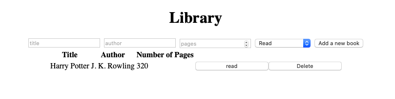

# Library-js

> This project consists of creating a basic DOM manipulation website in which we are able to Add and Delete books.



## Built With

- HTML
- CSS
- JavaScript

## Getting Started

### Prerequisites
- Any Browser
To get started open the directory where you will save this repo by typing on your terminal:
```
$ cd <directory>
```
- Clone the repo typing:
```
$ git clone git@github.com:brugobi/library-js.git
```

### Usage
- In any Brownser open index.html


## Authors

👤 **Bruna Gobi**
- Github: [@brugobi](https://github.com/brugobi)
- Twitter: [@BrunaGobi2](https://twitter.com/BrunaGobi2)
- Linkedin: [bruna-gobi](https://www.linkedin.com/in/bruna-gobi/)

👤 **Gerónimo Morisot**

- Github: [@Bismarck-GM](https://github.com/Bismarck-GM)
- Twitter: [@Rewritablee](https://twitter.com/Rewritablee)
- Linkedin: [geronimomorisot](https://linkedin.com/in/geronimomorisot)

## 🤝 Contributing

Contributions, issues and feature requests are welcome!

Feel free to check the [issues page](issues/).

## Show your support!

Give a ⭐️ if you like this project!

## Acknowledgments

- Microverse

## 📝 License

This project is [MIT](LICENCE) licensed.
